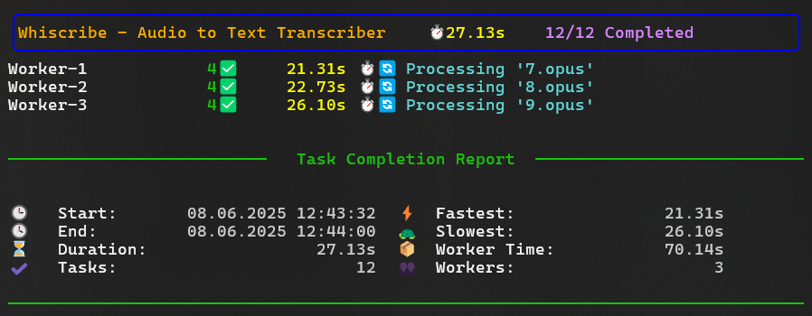
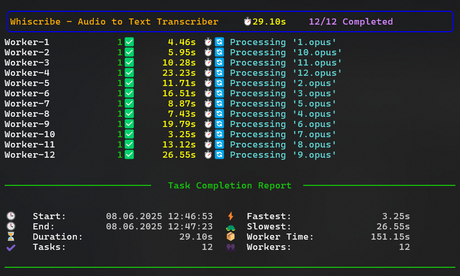

# TaskTracker

[](https://opensource.org/licenses/MIT)
[](https://www.python.org/downloads/)
[](https://github.com/sungurerdim/tasktracker)

**TaskTracker** is a simple and modular terminal-based task manager for Python. It provides a worker system to run tasks in parallel using threads and offers a rich terminal UI for real-time progress and statistics — all with detailed logging.

---

## ✨ Features

- ✅ Minimal and pluggable design — integrate in 2 lines
- 🧶 Multi-threaded worker system
- 🌍 Silent terminal, all logs go to `.log` file
- 🌟 Rich-powered live progress UI
- 📊 Tracks task durations, start/end times and total stats

---

## 📸 Screenshots




---

## 📦 Installation

Clone & install in editable mode:

```bash
git clone https://github.com/sungurerdim/tasktracker.git
cd tasktracker
pip install -e .
```

Install directly from GitHub:

```bash
pip install git+https://github.com/sungurerdim/tasktracker.git
```

## 🚀 Quick Start

```python
from tasktracker.task import Task
from tasktracker.runner import run
from tasktracker.logger import logger
import time, random

def my_action(file_path):
    logger.info(f"Processing file: {file_path}")
    time.sleep(random.uniform(2.70,14.65))
    return True

if __name__ == "__main__":
    tasks = [
        Task(data="input/file_a.txt", name="File A", desc="Convert A to X"),
        Task("input/file_b.txt"),
        Task("input/file_c.txt", "File C", "Convert C to Z", ),
    ]

    run(
        title="Demo Process",
        action=my_action,
        tasks=tasks,
        worker_count=2
    )
```

---

## 📁 Project Structure

```
.
├── tasktracker/                # Core module
│   ├── __init__.py
│   ├── display.py              # Terminal UI components
│   ├── logger.py               # Logging setup
│   ├── runner.py               # run() logic
│   ├── task.py                 # Task definition
│   └── worker.py               # Thread-based workers
├── logs/
│   └── tasktracker.log         # Auto-generated logs
├── main.py                     # Example usage
└── README.md
```

## 🔍 Task Class

```python
Task(
    data="file.txt",
    name="Optional Name",
    desc="Optional Description"
)
```

- `data`: any payload (file path, object, etc.)
- `name`: (optional) short name for display
- `desc`: (optional) longer description

## 📋 run() Parameters

| Parameter      | Type           | Required | Description                                  |
|----------------|----------------|----------|----------------------------------------------|
| `title`        | `str`          | ✅        | Displayed in terminal header                 |
| `action`       | `Callable`     | ✅        | The function to run on each task’s `data`    |
| `tasks`        | `list[Task]`   | ✅        | The list of tasks to process                 |
| `worker_count` | `int`          | ❌        | Number of workers (default = 2)              |

## 📄 Logging

- All logs go to `logs/tasktracker.log`
- Log level is `DEBUG` by default
- Terminal is kept clean — no stdout noise

## 📈 Terminal UI

- Live updating per-worker status (task name, description, elapsed time)
- Summary report at the end (start/end times, total duration, per-worker times)

---

## 📜 License
MIT

## 💬 Contact
For issues or contributions, please visit [GitHub Issues](https://github.com/sungurerdim/tasktracker/issues).
